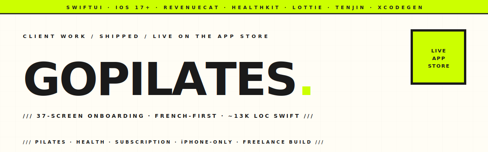

<p align="center">
  <picture>
    <source media="(prefers-color-scheme: dark)" srcset="assets-readme/hero-banner-dark.svg" />
    
  </picture>
</p>

<p align="center">
  <a href="https://apps.apple.com/us/app/gopilates-app/id6760300479"></a>
  
  
  
  
</p>

<p align="center">
  <em><strong>GoPilates</strong> — a French-first Pilates app on the App Store. ~13k LOC of SwiftUI, a 37-screen onboarding funnel, RevenueCat-powered subscriptions, HealthKit integration, Lottie animations, and Tenjin attribution. iPhone-only, iOS 17+, shipped for the client (DRF GROUP LLC). This repo is the public archive of the build.</em>
</p>

<p align="center">
  <a href="https://apps.apple.com/us/app/gopilates-app/id6760300479">
    
  </a>
</p>

---

### `/// THE BRIEF`

Build a Pilates app for francophone users that feels less like a fitness tracker and more like a guided studio — emotional onboarding, body-zone targeting, weight-projection visuals, and a subscription that converts because users have already invested 37 screens into their plan. RevenueCat handles the paywall, HealthKit logs the workouts, Tenjin tracks the install attribution. Apple's App Store, no Android.

---

### `/// HIGHLIGHTS`

| | |
|---|---|
| **37-screen onboarding funnel** | Goal, body-type, current/target weight, fitness level, daily life, difficulty, emotional drivers, affirmations, future pacing, social proof — the full BetterMe-style conversion arc. Implementations live under [`GoPilates/Onboarding/`](GoPilates/Onboarding/). |
| **RevenueCat subscriptions** | Centralised in [`SubscriptionManager`](GoPilates/Services/SubscriptionManager.swift). Free trial → paid plans configured via RevenueCat's dashboard, not hardcoded in the app. StoreKit config for local testing in [`Configuration.storekit`](Configuration.storekit). |
| **HealthKit integration** | [`HealthKitManager`](GoPilates/Services/HealthKitManager.swift) — workouts log into the Apple Health app, contributing to Activity rings. Read + write usage strings declared in `Info.plist`. |
| **Tenjin attribution** | [`TenjinService`](GoPilates/Services/TenjinService.swift) — install attribution + event tracking for paid ads. Per-event guard against the deprecation warnings the SDK throws on iOS 17+. |
| **Workout player** | [`WorkoutPlayerView`](GoPilates/Workout/WorkoutPlayerView.swift) — timed exercise loops with audio cues, [`WorkoutTimerService`](GoPilates/Services/WorkoutTimerService.swift) drives the countdown, Lottie animations on visual states. |
| **AudioManager** | [`AudioManager`](GoPilates/Services/AudioManager.swift) — plays through `.mixWithOthers` so a Pilates session doesn't clobber the user's music. |
| **XcodeGen project** | [`project.yml`](project.yml) → `.xcodeproj` regenerated from spec. Easier for code review, easier for CI. |
| **Xcode Cloud CI scripts** | [`ci_scripts/`](ci_scripts/) — pre-build hooks for App Store builds. |
| **iPhone only** | `TARGETED_DEVICE_FAMILY = "1"` — no iPad layouts, no Mac Catalyst. Portrait only. |

---

### `/// STACK`

```
SwiftUI · Swift 5         · iOS 17+ · iPhone-only / portrait
RevenueCat                · subscription paywall
HealthKit                 · Apple Health write-through
Lottie                    · animated illustrations
Tenjin SDK                · install attribution
AVFoundation              · audio session + cue playback
XcodeGen + Xcode Cloud    · project + CI
```

---

### `/// PROJECT LAYOUT`

```
GoPilates/
├── App/GoPilatesApp.swift              @main entry; AVAudio + RevenueCat init
├── Onboarding/                         37 screens + OnboardingFlow.swift + OnboardingData.swift
├── Dashboard/                          home + day/streak progress
├── Workout/                            LazyWorkoutView + WorkoutPlayerView
├── Profile/                            user profile + settings
├── Library/                            program / exercise library
├── Models/                             UserProfile + persistence
├── Services/
│   ├── SubscriptionManager.swift       RevenueCat wrapper
│   ├── HealthKitManager.swift          read/write Apple Health
│   ├── TenjinService.swift             attribution + events
│   ├── AudioManager.swift              AVAudio session + cues
│   ├── WorkoutTimerService.swift       countdown engine
│   └── LottieAnimationService.swift    Lottie playback helper
├── Design/                             tokens, styles, reusable views
└── Resources/                          Assets.xcassets · Info.plist (fr-FR primary)

Configuration.storekit                  local StoreKit testing config
project.yml                             XcodeGen spec
ci_scripts/                             Xcode Cloud hooks
```

---

### `/// LOCAL DEV`

```bash
# 1. Generate the .xcodeproj from project.yml (if XcodeGen isn't installed):
brew install xcodegen
xcodegen generate

# 2. Open in Xcode
open GoPilates.xcodeproj

# 3. RevenueCat: the publishable iOS API key in GoPilatesApp.swift is the
#    PUBLIC key (designed for client-side use, like a Stripe publishable
#    key). For your own builds, swap it for your own app key.

# 4. For local subscription testing, use the bundled Configuration.storekit
#    file as the StoreKit configuration in the run scheme.
```

Requires Xcode 16+. Runs on iOS 17+ devices (project deployment target is 18.0; App Store binary serves 17.0+).

---

### `/// STATUS`

🟢 **Live on the [App Store](https://apps.apple.com/us/app/gopilates-app/id6760300479)**, shipped to production. Engagement complete; this repo is the public archive of the build.

---

<p align="center">
  <a href="https://hatimelhassak.is-a.dev"></a>
  <a href="https://cal.com/hatimelhassak/engineering-discovery"></a>
  <a href="https://www.linkedin.com/in/hatim-elhassak/"></a>
  <a href="mailto:hatimelhassak.official@gmail.com"></a>
</p>

<p align="center">
  <code>///&nbsp;&nbsp;OPEN FOR NEW WORK&nbsp;&nbsp;///&nbsp;&nbsp;CONTRACT &amp; FREELANCE&nbsp;&nbsp;///&nbsp;&nbsp;REMOTE WORLDWIDE&nbsp;&nbsp;///</code>
</p>
